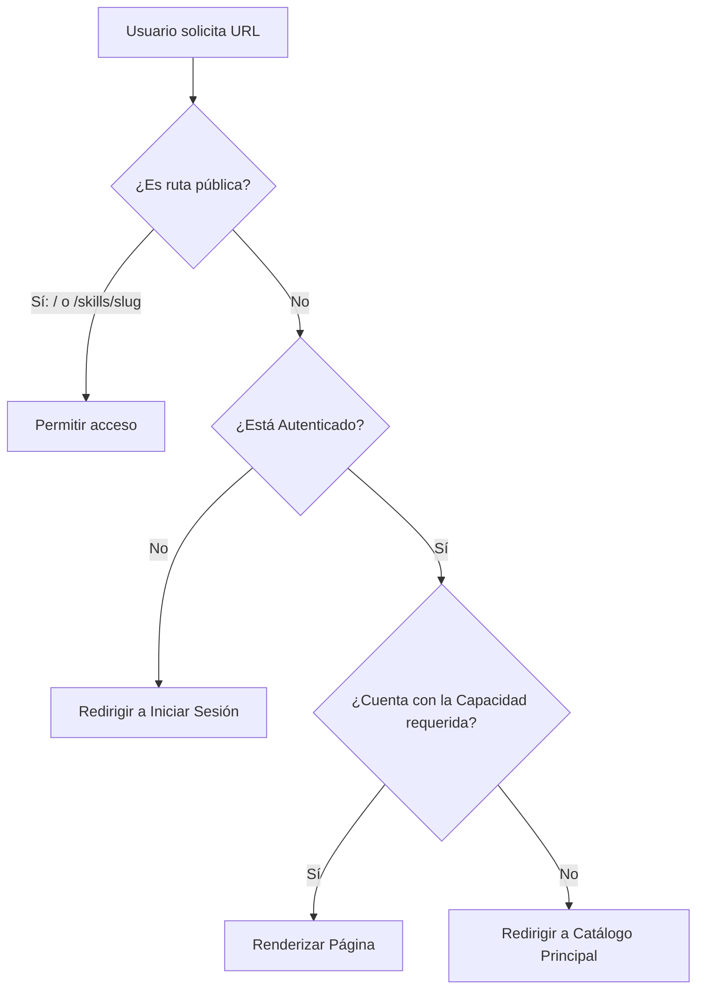

# Modelo de Seguridad y Matriz de Roles (RBAC)

Este documento detalla el modelo de control de acceso basado en roles (RBAC) de **SkillVault**, especificando las capacidades de cada rol, las restricciones de acceso por ruta de página, y las políticas de seguridad de doble control.

---

## 1. Roles de la Aplicación

SkillVault define **cinco roles principales** que controlan los niveles de privilegios de los usuarios. Todo usuario autenticado cuenta, como mínimo, con el rol base de `user`.

| Rol | Descripción General |
| :--- | :--- |
| **`user`** | Usuario registrado estándar de la plataforma. Acceso de solo lectura y calificación. |
| **`author`** | Creador de contenido. Puede proponer skills y gestionar su propio catálogo ("Mis Skills"). |
| **`editor`** | Editor autorizado. Cuenta con capacidad de publicar directamente propuestas de skills. |
| **`reviewer`** | Evaluador técnico. Responsable de revisar, sugerir cambios y aprobar skills propuestos por otros usuarios. |
| **`admin`** | Administrador de la plataforma. Control total sobre categorías, asignación de usuarios y configuraciones globales. |

---

## 2. Matriz de Capacidades

Para garantizar una arquitectura extensible y modular, la seguridad de la aplicación se gestiona mediante **Capacidades**. Cada rol hereda de manera acumulativa o discreta un conjunto de capacidades técnicas:

| Capacidad | Descripción Técnica | `user` | `author` | `editor` | `reviewer` | `admin` |
| :--- | :--- | :---: | :---: | :---: | :---: | :---: |
| **`catalog:read`** | Lectura del catálogo principal y detalles de skills. | ✅ | ✅ | ✅ | ✅ | ✅ |
| **`rating:write`** | Envío de calificaciones de las skills. | ✅ | ✅ | ✅ | ✅ | ✅ |
| **`content:manage`** | Acceso a "Mis Skills", visualización de propuestas propias e inicio de edición de sus skills. | ❌ | ✅ | ✅ | ✅ | ✅ |
| **`publish:create`** | Capacidad de crear y proponer nuevas skills en la plataforma. | ❌ | ❌ | ✅ | ❌ | ✅ |
| **`review:manage`** | Capacidad de evaluar, aprobar y rechazar skills propuestos. | ❌ | ❌ | ❌ | ✅ | ✅ |
| **`admin:manage`** | Gestión administrativa global de categorías y permisos de usuarios locales. | ❌ | ❌ | ❌ | ❌ | ✅ |

---

## 3. Seguridad de Rutas y Middleware (`src/proxy.ts`)

La protección de rutas se ejecuta en el lado del servidor a nivel de middleware en `src/proxy.ts` (impulsado por la directiva de políticas en `src/lib/auth/access-policy.ts`). Esto previene el acceso no autorizado antes de procesar o renderizar componentes.

### Detalle de Accesibilidad por Ruta

| Ruta | Nombre en UI | Capacidad Requerida | Roles Permitidos |
| :--- | :--- | :--- | :--- |
| `/` | Catálogo Principal | *Pública* | Todos (Anónimos y Autenticados) |
| `/skills/[slug]` | Detalle de Skill | *Pública* | Todos (Anónimos y Autenticados) |
| `/dashboard` | Mis Skills | `content:manage` | `author`, `editor`, `reviewer`, `admin` |
| `/proposals` | Mis Propuestas | `content:manage` | `author`, `editor`, `reviewer`, `admin` |
| `/agents` | Agentes IA | `content:manage` | `author`, `editor`, `reviewer`, `admin` |
| `/skills/[slug]/edit`| Editar Skill | `content:manage` | `author`, `editor`, `reviewer`, `admin` |
| `/skills` | Listado de Skills | `content:manage` | `author`, `editor`, `reviewer`, `admin` |
| `/publish` | Publicar Skill | `publish:create` | `editor`, `admin` |
| `/review` | Cola de Revisión | `review:manage` | `reviewer`, `admin` |
| `/categories` | Categorías | `admin:manage` | `admin` |
| `/users` | Usuarios y Roles | `admin:manage` | `admin` |

---

## 4. Políticas Especiales de Seguridad

### 4.1 Principio de Doble Control (4-Eyes Principle)
Para garantizar la integridad y calidad del catálogo de SkillVault, se aplica la regla estricta de que **ningún autor puede aprobar sus propias propuestas de skills**, incluso si cuenta con roles con capacidad de revisión (`reviewer` o `admin`).

* **Validación en Backend:** La función `decideReviewRequest` en `src/lib/review/auth.ts` rechaza cualquier intento de decisión si `request.authorId === actor.id`.
* **Seguridad en UI:** Los botones de decisión (**Aprobar**, **Pedir Cambios**, **Rechazar**) se ocultan en la vista `/review/[id]` cuando el usuario logueado coincide con el autor de la propuesta.

### 4.2 Sincronización Keycloak → DB Local
* Los roles del cliente `skillvault` configurados en Keycloak se extraen dinámicamente mediante `getEffectiveSkillVaultRoles` al momento de iniciar sesión.
* En cada login exitoso (`signIn` callback), se sincroniza el registro local de usuarios de forma bidireccional (añadiendo roles nuevos y revocando roles que ya no figuren en Keycloak).
* Si la base de datos de SkillVault experimenta una caída momentánea o latencia, un bloque `try/catch` previene el bloqueo de inicio de sesión del usuario, garantizando resiliencia de producción.
