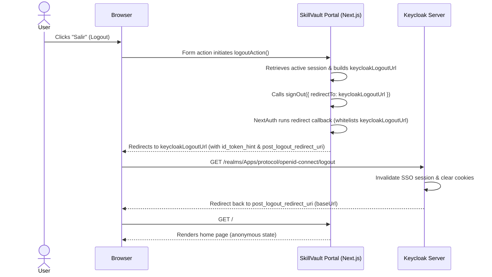

# Design Spec: Keycloak SSO Logout Redirect Configuration

## Context & Overview

In the application `skillvault` (built with Next.js 16 and NextAuth v5 / Auth.js), when a user performs a logout, the local application session is cleared successfully. However, the browser's Single Sign-On (SSO) session in the external Keycloak provider (`https://oauth2.qa.comsatel.com.pe`) remains active. 

As a result, if a user attempts to log in as a different user in the same browser session without manually clearing cookies, Keycloak throws the following error:
> *You are already authenticated as different user 'username' in this session. Please sign out first.*

### Root Cause
1. In `src/app/actions/auth.ts`, the `logoutAction` builds a Keycloak federated logout URL (`keycloakLogoutUrl`) using `AUTH_KEYCLOAK_ISSUER`.
2. It then calls NextAuth's `signOut({ redirectTo: keycloakLogoutUrl })`.
3. Because NextAuth v5's default `redirect` callback blocks redirection to any external domain for security reasons (to prevent open redirect vulnerabilities), it overrides `keycloakLogoutUrl` and redirects the user back to the application's local `baseUrl` (e.g. `http://localhost:3010/`).
4. Since the browser never navigates to the Keycloak logout endpoint, the Keycloak session cookies are never cleared, leaving the SSO session active.

## Architecture & Configuration

We will customize the NextAuth configuration to whitelist the Keycloak issuer URL for external redirections.

### 1. NextAuth Callback Customization (`src/auth.ts`)

We will add a custom `redirect` callback to the `callbacks` object of the `NextAuth` options in [src/auth.ts](file:///C:/Users/ianache/Desktop/DATA/01-DOCUMENTOS/02-PROYECTOS/112-skillvault/src/auth.ts):

```typescript
  callbacks: {
    async redirect({ url, baseUrl }) {
      const issuer = process.env.AUTH_KEYCLOAK_ISSUER;
      // Allow redirecting to the Keycloak issuer domain (specifically for federated logout)
      if (issuer && url.startsWith(issuer)) {
        return url;
      }
      
      // Allow relative callback URLs
      if (url.startsWith("/")) {
        return `${baseUrl}${url}`;
      }
      
      // Allow same-origin redirects
      try {
        const urlObj = new URL(url);
        const baseUrlObj = new URL(baseUrl);
        if (urlObj.origin === baseUrlObj.origin) {
          return url;
        }
      } catch (e) {
        // Fallback to baseUrl if URL parsing fails
      }
      
      return baseUrl;
    },
    jwt({ token, user, profile, account }) {
      // Existing JWT callback remains unchanged
      return token;
    },
    session({ session, token }) {
      // Existing Session callback remains unchanged
      return session;
    },
  }
```

### 2. Federated Logout Data Flow



## Verification Criteria

1. **Successful Redirect to Keycloak Logout**: Clicking the "Salir" button in the `UserMenu` redirects the browser to the Keycloak logout endpoint (`https://oauth2.qa.comsatel.com.pe/realms/Apps/protocol/openid-connect/logout?...`).
2. **SSO Session Termination**: After logout, accessing the login page (`/api/auth/signin` or clicking "Iniciar sesión") redirects the user to the Keycloak login screen, requiring credential entry (instead of logging back in automatically or throwing an error).
3. **No Open Redirect Vulnerabilities**: Redirecting to arbitrary untrusted external domains (e.g. `https://evil.com`) remains blocked by the callback, returning the default `baseUrl`.
