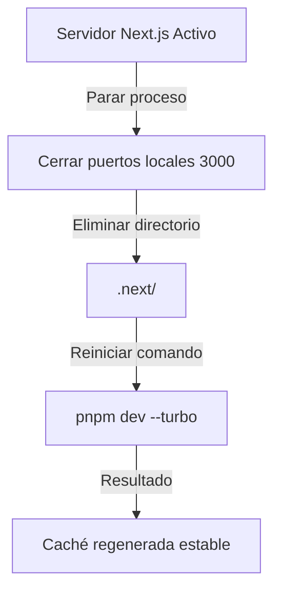

# Especificación de Resolución del Conflicto de Caché de Next.js (Turbopack)

**Fecha:** 2026-07-27  
**Problema:** La base de datos de caché incremental de Turbopack se bloquea internamente arrojando el error: `"Persisting failed: Another write batch or compaction is already active"`. Esto corrompe las respuestas del servidor ante Server Actions (como `logoutAction`), bloqueando redirecciones HTTP y provocando excepciones de red en el navegador.

## 1. Arquitectura de Diagnóstico y Mitigación

El conflicto reside enteramente en el motor de almacenamiento de caché de compilación (`.next/`). Al tratarse de un entorno de desarrollo volátil, no existen dependencias de base de datos de producción o estados persistentes dentro de esta carpeta.

La mitigación consiste en realizar un reinicio atómico del compilador.

## 2. Plan de Tareas de Ejecución

1. **Parar procesos activos de Node / Next.js:** Asegurarse de que no haya múltiples instancias del servidor de desarrollo corriendo simultáneamente en segundo plano en el puerto `3000` u otros puertos que bloqueen el acceso al sistema de archivos.
2. **Eliminación limpia de la caché:** Borrar recursivamente la carpeta `.next/` para liberar los descriptores de archivos de base de datos bloqueados de Turbopack.
3. **Reconstrucción y Verificación:** Levantar el servidor de desarrollo y verificar que el inicio de sesión y cierre de sesión se ejecuten de manera fluida y exitosa, sin errores de compactación ni fallos en el navegador.
