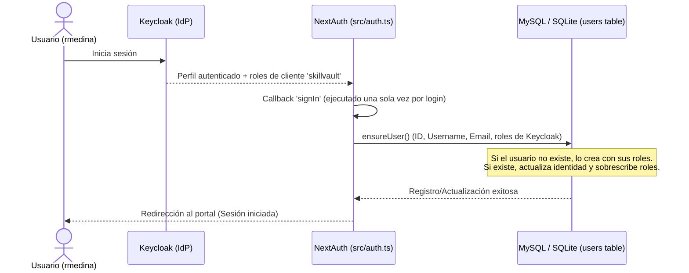

# Especificación de Diseño: Sincronización Automática de Usuarios y Roles (Keycloak → DB)

Este documento detalla el diseño técnico para garantizar que cualquier usuario que inicie sesión en SkillVault a través de Keycloak sea registrado o actualizado automáticamente en la base de datos local, manteniendo sus roles sincronizados en tiempo real en cada inicio de sesión.

---

## 1. Contexto y Objetivos

Actualmente, el sistema cuenta con un panel administrativo de "Usuarios y Roles" (`/users`) para la gestión de permisos internos de SkillVault. Sin embargo, se ha identificado el siguiente comportamiento:
1. Un usuario regular (como `rmedina`) inicia sesión y publica un skill, pero **no aparece** en la lista de "Usuarios y Roles".
2. Esto ocurre porque la tabla de base de datos local `users` únicamente se puebla cuando un Administrador visita la página `/users` (registrando únicamente al administrador logueado en ese momento).
3. No existe un disparador automático que registre a los usuarios generales durante el inicio de sesión.
4. Adicionalmente, el método actual `ensureUser` evita deliberadamente actualizar los roles de un usuario existente en subsecuentes inicios de sesión, impidiendo que los cambios de roles en Keycloak se reflejen automáticamente.

### Objetivos:
* **Autoregistro al iniciar sesión**: Registrar automáticamente a todo usuario autenticado en la base de datos local.
* **Sincronización bidireccional/tiempo real de roles**: Actualizar (añadir o retirar) los roles locales del usuario en cada inicio de sesión según los roles del cliente `'skillvault'` provistos en el token de Keycloak.

---

## 2. Arquitectura de Sincronización



---

## 3. Especificaciones Técnicas de Implementación

### A. Integración en NextAuth (`src/auth.ts`)
Implementaremos el callback `signIn` dentro del objeto `NextAuthConfig.callbacks` de `src/auth.ts`. 

Este callback es el lugar idóneo porque:
1. Se ejecuta inmediatamente después de una autenticación exitosa.
2. Se ejecuta **una sola vez por evento de inicio de sesión**, lo que evita sobrecargar la base de datos en cargas de páginas posteriores (a diferencia del callback `session`).

```typescript
import { ensureUser } from "@/lib/users/service";

// Dentro de NextAuthConfig.callbacks:
async signIn({ user }) {
  if (user?.id) {
    await ensureUser({
      id: user.id,
      username: user.name ?? user.email ?? user.id,
      email: user.email ?? "",
      keycloakRoles: user.roles, // Roles de Keycloak resueltos para el cliente 'skillvault'
    });
  }
  return true; // Continuar con el inicio de sesión
}
```

### B. Modificación de `ensureUser` (`src/lib/users/service.ts`)
Modificaremos la función `ensureUser` para habilitar la sincronización de roles en usuarios ya existentes.

1. **Resolución de Roles**: Filtrar los roles recibidos desde el token de Keycloak para conservar únicamente aquellos definidos en `APP_ROLES` (`author`, `admin`, `reviewer`).
2. **Actualización del Query de Update**: Cambiar la consulta SQL de actualización para incluir el campo `roles`.

```typescript
export async function ensureUser(user: { id: string; username: string; email: string; keycloakRoles?: string[] }): Promise<void> {
  const whereClauses = ["id = ?", "username = ?"];
  const args: unknown[] = [user.id, user.username];
  if (user.email && user.email.trim() !== "") {
    whereClauses.push("email = ?");
    args.push(user.email);
  }

  const existing = await client.execute({
    sql: `SELECT * FROM users WHERE ${whereClauses.join(" OR ")} ORDER BY last_login_at DESC`,
    args,
  });

  const now = Math.floor(Date.now() / 1000);
  const currentRoles = (user.keycloakRoles ?? []).filter((r): r is AppRole => APP_ROLES.includes(r as AppRole));

  if (existing.rows.length === 0) {
    // Si no existe, se inserta con los roles iniciales mapeados desde Keycloak
    await client.execute({
      sql: `INSERT INTO users (id, username, full_name, email, roles, last_login_at, created_at, updated_at)
            VALUES (?, ?, ?, ?, ?, ?, ?, ?)`,
      args: [user.id, user.username, user.username, user.email, JSON.stringify(currentRoles), now, now, now],
    });
    return;
  }

  const primary = existing.rows[0] as Record<string, unknown>;
  const primaryId = String(primary.id);

  // NUEVO: Se añade 'roles = ?' a la actualización para mantenerlos sincronizados en cada ingreso
  await client.execute({
    sql: `UPDATE users SET id = ?, username = ?, full_name = ?, email = ?, roles = ?, last_login_at = ?, updated_at = ?
          WHERE id = ?`,
    args: [user.id, user.username, user.username, user.email, JSON.stringify(currentRoles), now, now, primaryId],
  });

  if (existing.rows.length > 1) {
    const duplicateIds = existing.rows.slice(1).map((r) => String(r.id)).filter((id) => id !== user.id);
    if (duplicateIds.length > 0) {
      const placeholders = duplicateIds.map(() => "?").join(",");
      await client.execute({
        sql: `DELETE FROM users WHERE id IN (${placeholders})`,
        args: duplicateIds,
      });
    }
  }
}
```

---

## 4. Plan de Pruebas y Criterios de Aceptación (UAT)

Para verificar el correcto funcionamiento, realizaremos las siguientes validaciones:

1. **UAT 1: Autoregistro al Login**:
   * Simular el inicio de sesión de un usuario de Keycloak que no existe en la base de datos local.
   * Verificar que se inserte un registro en la tabla `users` con sus datos y roles iniciales.

2. **UAT 2: Sincronización al Añadir Roles**:
   * Iniciar sesión con un usuario ya registrado, pero añadiendo un nuevo rol en Keycloak.
   * Verificar que al entrar al sistema, el nuevo rol aparezca guardado en la columna `roles` de la base de datos local.

3. **UAT 3: Sincronización al Retirar Roles**:
   * Iniciar sesión con un usuario ya registrado, retirando uno de sus roles en Keycloak.
   * Verificar que al entrar, el rol removido ya no figure en su columna `roles` local.

4. **UAT 4: No Duplicación**:
   * Comprobar que inicios de sesión múltiples del mismo usuario actualicen el mismo registro (basándose en su `id` o `username`) en lugar de crear registros duplicados.
