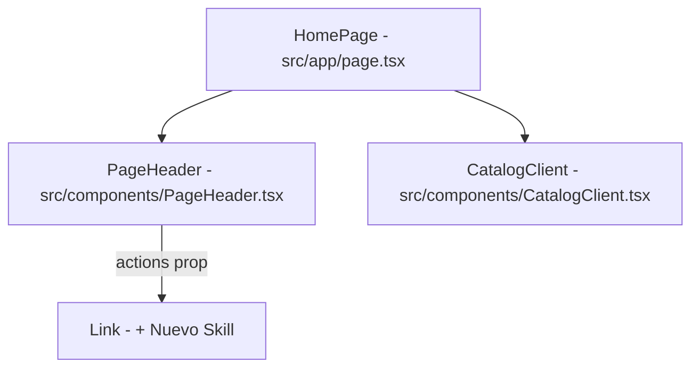

# Especificación Técnica: Botón + Nuevo Skill en el Catálogo de Skills

Este documento detalla el diseño técnico para reposicionar y renombrar el botón de publicación de skills en la página principal de SkillVault.

---

## 1. Requerimientos

### Funcionales
- Mover el botón "+ Publicar Skill" desde el panel de categorías izquierdo (Sidebar) de la página principal hacia el panel de cabecera (`PageHeader`).
- Renombrar el botón de "+ Publicar Skill" a "+ Nuevo Skill".
- El botón debe seguir redirigiendo de forma segura a `/publish`.

### Visuales y de Diseño
- Ubicar el botón alineado a la derecha en el panel de título y descripción (`PageHeader`), debajo de la barra horizontal de menú principal.
- Utilizar la paleta de colores y variables del Design System (`var(--accent)`, `borderRadius: "6px"`, `fontWeight: 600`, etc.).
- Eliminar el botón antiguo "+ Publicar Skill" junto con la línea divisoria horizontal en el sidebar.

---

## 2. Arquitectura de Componentes



### Cambios en Servidor (`src/app/page.tsx`)
- Importar `Link` desde `"next/link"`.
- Pasar el componente `<Link>` estilizado como la propiedad `actions` en el renderizado de `<PageHeader />`.

### Cambios en Cliente (`src/components/CatalogClient.tsx`)
- Eliminar el bloque de contenedor divisorio y el elemento anchor `+ Publicar Skill` de la barra lateral izquierda `<aside>`.

---

## 3. Código Detallado

### `src/app/page.tsx`
```typescript
// Agregar import
import Link from "next/link";

// Modificar PageHeader
<PageHeader
  title={q ? `Resultados para "${q}"` : "Catálogo de Skills"}
  description="Skills reutilizables para Claude Code y otros harnesses compatibles con el estándar SKILL.md de Anthropic."
  actions={
    <Link
      href="/publish"
      style={{
        padding: "9px 18px",
        background: "var(--accent)",
        border: "none",
        borderRadius: "6px",
        color: "#fff",
        cursor: "pointer",
        fontSize: "13px",
        fontWeight: 600,
        textDecoration: "none",
        boxShadow: "0 1px 3px rgba(0,0,0,0.15)",
        display: "flex",
        alignItems: "center",
        gap: "6px",
      }}
    >
      + Nuevo Skill
    </Link>
  }
/>
```

### `src/components/CatalogClient.tsx`
```diff
-        <div
-          style={{
-            margin: "20px 16px 0",
-            paddingTop: "16px",
-            borderTop: "1px solid var(--border)",
-          }}
-        >
-          <a
-            href="/publish"
-            style={{
-              display: "flex",
-              alignItems: "center",
-              gap: "6px",
-              padding: "8px 10px",
-              borderRadius: "4px",
-              border: "1px solid var(--accent)",
-              background: "var(--accent-muted)",
-              color: "var(--accent)",
-              textDecoration: "none",
-              fontSize: "12px",
-              fontWeight: 600,
-              transition: "background .12s",
-            }}
-          >
-            + Publicar Skill
-          </a>
-        </div>
```

---

## 4. Pruebas y Verificación

- **Compilación:** `pnpm tsc --noEmit` y `pnpm build` deben completarse de manera exitosa sin lints ni errores de TypeScript.
- **Pruebas de Humo:** Ejecutar `pnpm test` para certificar que la suite completa pase al 100%.
- **Funcional:** El botón de la cabecera debe responder correctamente dirigiendo al wizard `/publish`.
