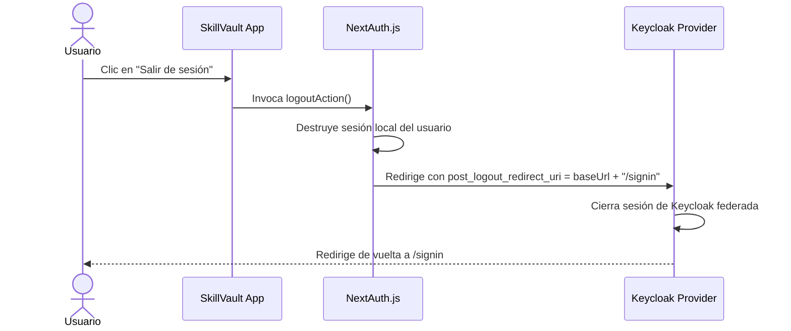

# Especificación de Diseño: Redirección Estricta a /signin en Login y Logout

Esta especificación detalla el diseño técnico para redirigir de forma estricta y determinista a los usuarios a la página `/signin` tanto cuando cierran sesión como cuando pulsan el botón de iniciar sesión en el portal SkillVault.

---

## 1. Contexto y Objetivos

- **Objetivo 1:** Asegurar que al cerrar sesión ("Salir de sesión"), el usuario sea redirigido de manera estricta y segura a la página `/signin` (limpiando tanto la sesión local como federada de Keycloak).
- **Objetivo 2:** Simplificar el componente `UserMenu.tsx` de modo que el botón "Iniciar sesión" dirija directamente a `/signin` sin añadir parámetros de búsqueda contextuales (`callbackUrl`), mejorando la ergonomía y la velocidad de renderizado.
- **Objetivo 3:** Actualizar la suite de pruebas unitarias y de humo para validar esta simplificación del flujo de navegación.

---

## 2. Arquitectura Detallada y Flujo de Datos

### Flujo de Logout (Cierre de Sesión)



---

## 3. Impacto en Componentes y Archivos

### 3.1. Acciones de Autenticación de Servidor (`src/app/actions/auth.ts`)

- **Cambio en `buildKeycloakLogoutUrl`**:
  Configurar el parámetro `post_logout_redirect_uri` para que apunte a `${baseUrl}/signin` en lugar de `${baseUrl}` de modo que Keycloak redirija directamente a la pantalla de credenciales de entrada al finalizar.
- **Cambio en `logoutAction`**:
  Ajustar el fallback de la función nativa `signOut` de NextAuth para redirigir a `/signin` si la sesión no contiene Hint de Token ID.

```typescript
// Antes:
logoutUrl.searchParams.set("post_logout_redirect_uri", baseUrl);
await signOut({ redirectTo: keycloakLogoutUrl ?? "/" });

// Después:
logoutUrl.searchParams.set("post_logout_redirect_uri", baseUrl + "/signin");
await signOut({ redirectTo: keycloakLogoutUrl ?? "/signin" });
```

---

### 3.2. Componente de Encabezado de Usuario (`src/components/UserMenu.tsx`)

- **Simplificación del Componente**:
  Remover la dependencia de los hooks de enrutamiento `usePathname` y `useSearchParams` de Next.js, eliminando renders adicionales del lado del cliente.
- **Cambio en el Botón "Iniciar sesión"**:
  Actualizar el elemento `<Link>` para dirigir directamente a la ruta estática `/signin`.

```typescript
// Antes:
const currentUrl = searchParams.toString() ? `${pathname}?${searchParams.toString()}` : pathname;
return (
  <Link href={`/signin?callbackUrl=${encodeURIComponent(currentUrl)}`}>
    Iniciar sesión
  </Link>
);

// Después:
return (
  <Link href="/signin">
    Iniciar sesión
  </Link>
);
```

---

### 3.3. Suite de Pruebas de Humo (`src/lib/review/ui-smoke.test.ts`)

- Ajustar el test estático `"UserMenu renders a sign-in Link..."` para remover la comprobación obsoleta de expresiones regulares para `usePathname`, `useSearchParams` y `callbackUrl`, asertando ahora la referencia exacta `href="/signin"`.

---

## 4. Estrategia de Verificación y Pruebas

Para garantizar la estabilidad y consistencia, se ejecutarán secuencialmente las siguientes verificaciones:
1. **Compilación estática:** `pnpm tsc --noEmit` para validar tipos y la correcta remoción de los hooks sin dejar variables o imports huérfanos.
2. **Suite de pruebas completa:** `pnpm test` para asegurar que las 132 aserciones pasen de forma impecable y libre de fallas.
3. **Verificación visual y de compilación:** `pnpm build` para asegurar la correcta generación de bundle estático.
